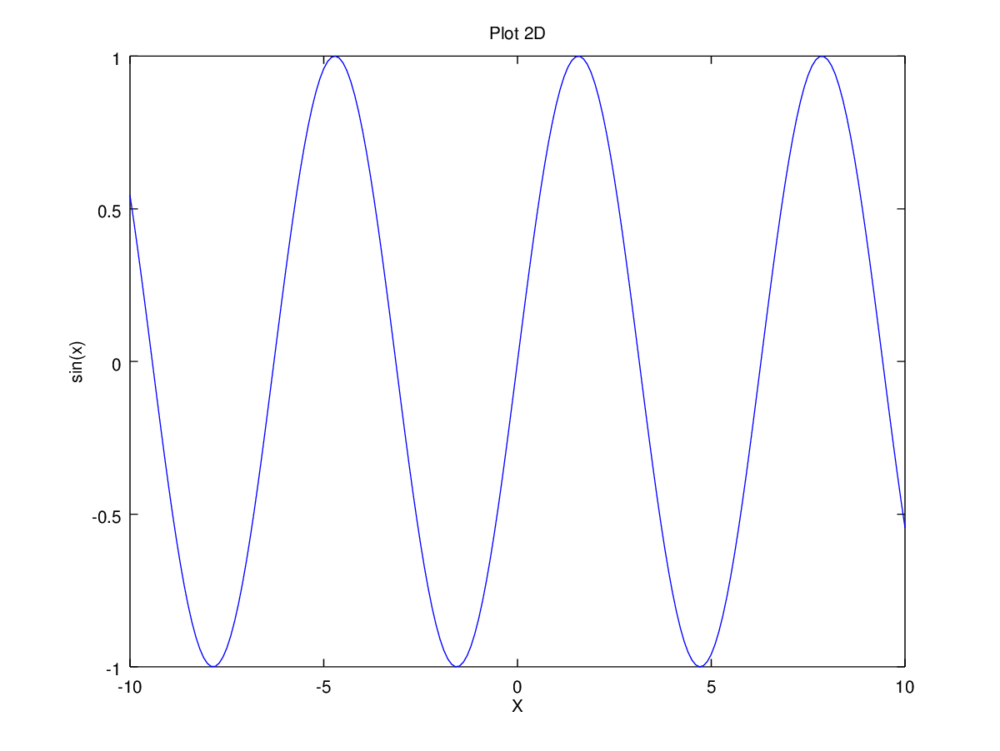

# Functii si scripturi in OCTAVE

Crearea filelelor s-a facut cu comanda:
``` M
edit file_name.
```
## salut.m
``` M
##
# Initializare
clear all; close all; clc
##
# Functia afiseaza un mesaj in consola
function salut
  printf("Salut OCTAVE!\n")
endfunction
```
## salut1.m
``` M
# Initializare
clear all; close all; clc
##
# Functia salut1 accepta un argument de tip string.
function salut1 (str_input)
  ##
  # Verificarea prezentei argumentului
  if(nargin != 1)
    print_usage("Functia primeste un argument de tip String.\n")
  endif
  ##
  # Verificarea argumentului functiei
  if(ischar(str_input))
    printf("Salut, %s! Bine ai venit!\n", str_input);
  else
    error("Functia are ca argument un string.\n");
  endif
endfunction
```
## nume.m
```
# Initializare
clear all; close all; clc
##
# Functia returneaza numele complet 
function [retval] = nume ()
  ##
  # Introducere date in aplicatie
  retval = "";
  nume = input("Introduceti numele persoanei: ", "s")
  prenume = input("Introduceti prenumele persoanei: ", "s");
  retval = [nume, " ", prenume];

endfunction
```
## create_plot.m
```
# Initializare 
clear all; close all; clc

x = -10:0.1:10; # Creaza un vector cu valori de la -10 .. 10
y = sin (x); # Este tot un vector

##
# Functia creaza un plot din doua inputuri

function create_plot (input1, input2)
  plot(input1, input2)
  title("Plot 2D");
  xlabel("X");
  ylabel("sin(x)");
endfunction

create_plot(x,y);
```
